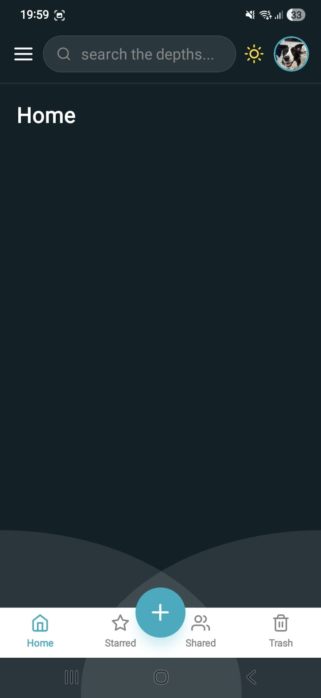
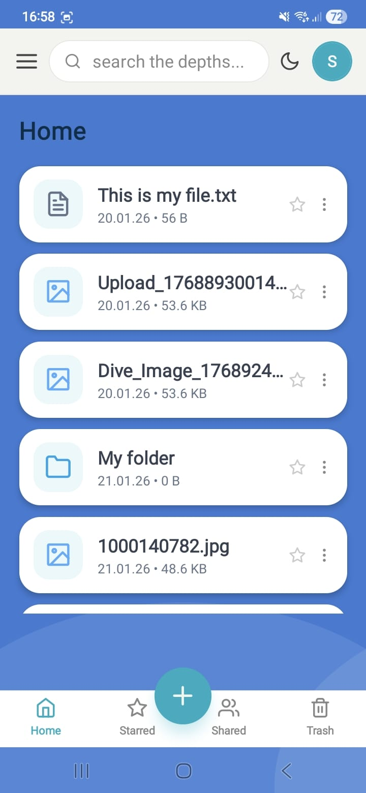
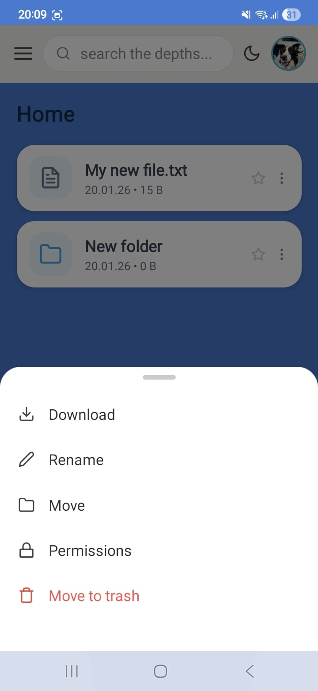
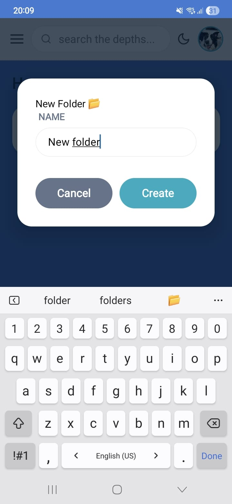
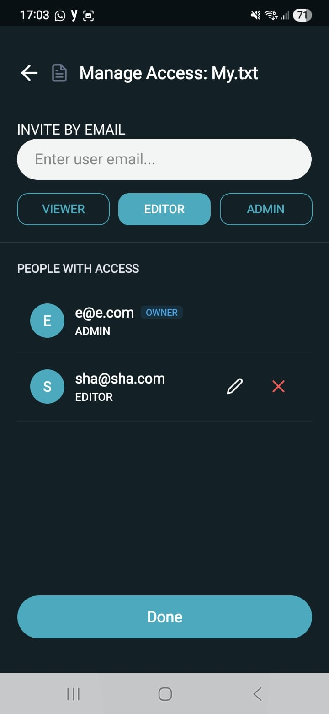

# File and Folder Management

The **S.E.A. D(R)IVE** dashboard provides a comprehensive interface for managing personal data, inspired by the Google Drive mobile experience.

## 1. Dashboard Navigation
The interface is optimized for mobile use, featuring a clean layout and intuitive navigation.

* **Dynamic File List**: The dashboard fetches and displays the user's specific files and folders from the server.
* **Folder Navigation (Stack Logic)**: Users can enter folders and sub-folders. The application maintains a "Folder Stack," allowing users to navigate deeper into their directories and return to previous levels using the back arrow.

## 2. File and Folder Operations
Users can interact with their data through various actions available in the Context Menu:

* **Creation**: Users can create new folders or upload documents and images directly from their mobile device.
* **Modification**: File names can be updated (Rename), and files can be relocated within the directory structure (Move).
* **Status Toggles**: Users can "Star" important files for quick access or move unused items to the Trash.
* **Permanent Deletion**: Items in the trash can be permanently removed, ensuring they are deleted from the MongoDB database.

## 3. Collaborative Permissions
Files can be shared with other users through a robust permission system.

* **Role Assignments**: Users can be invited to a file with specific roles: VIEWER, EDITOR, or ADMIN.
* **Visual Management**: Access can be revoked or updated using intuitive visual cues, such as the red 'X' to remove a collaborator.
* **Error Handling**: If a user attempts to add a collaborator who already has access, the UI provides a clear error notification.

