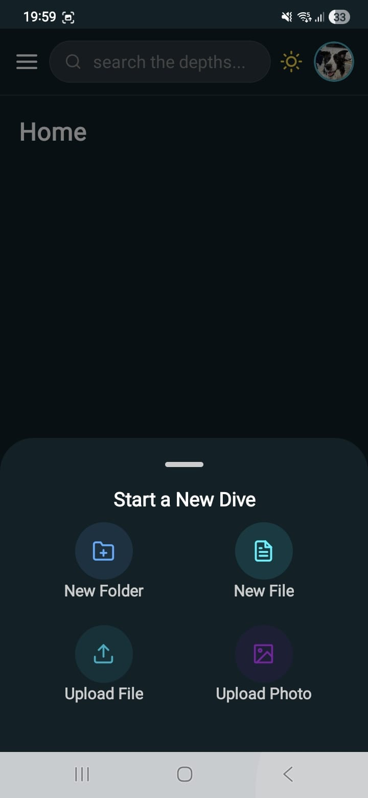
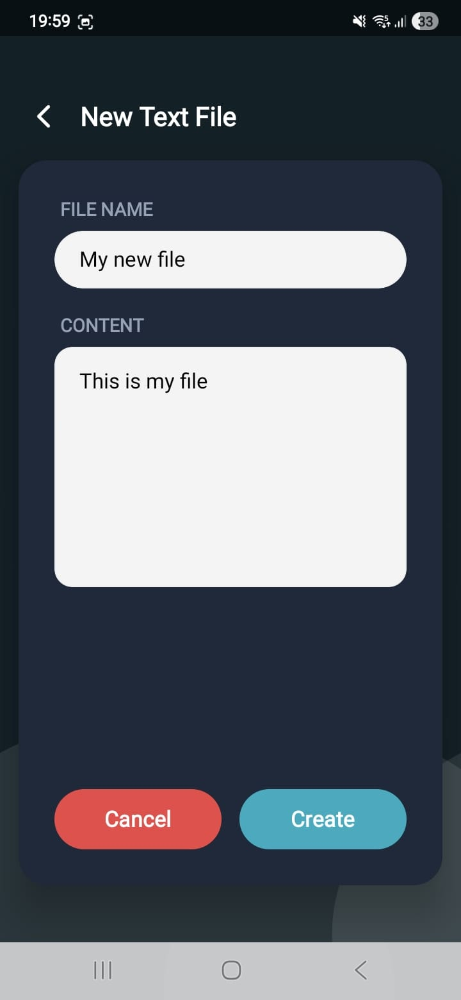
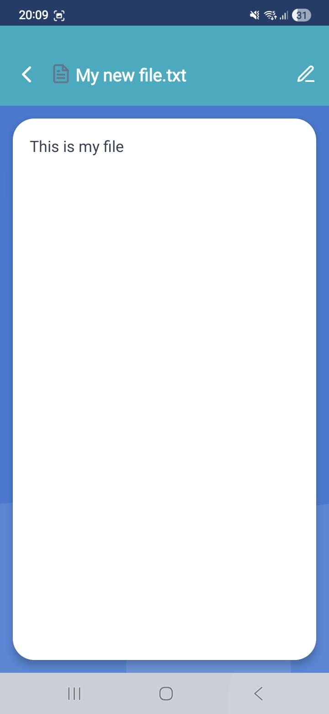
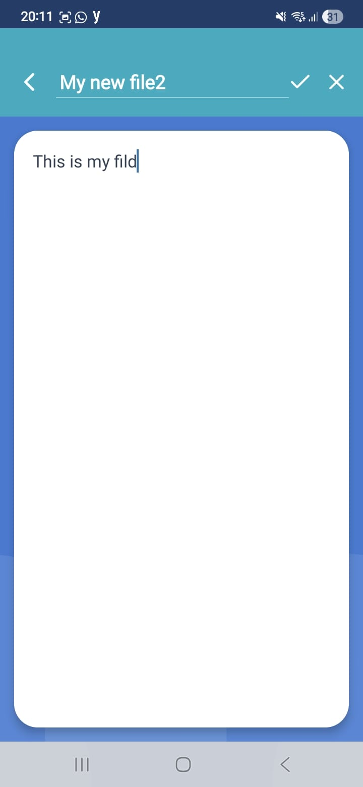
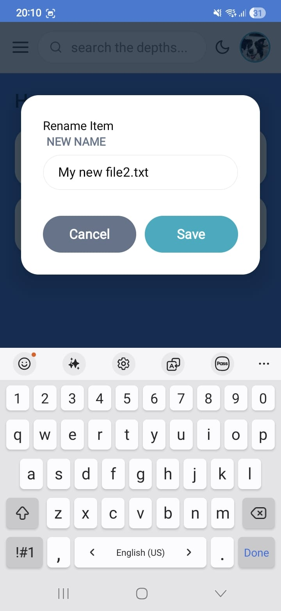
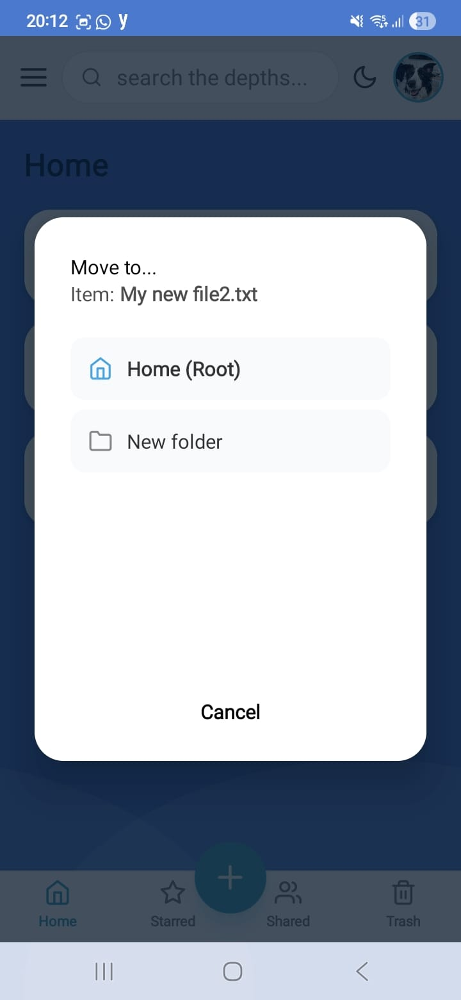
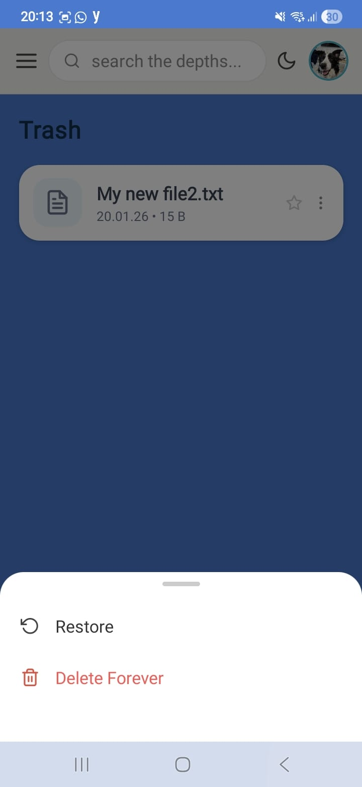
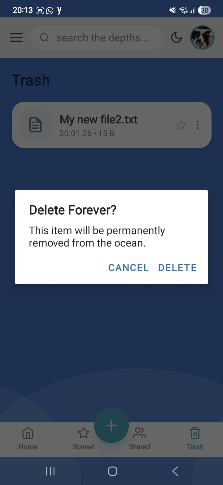
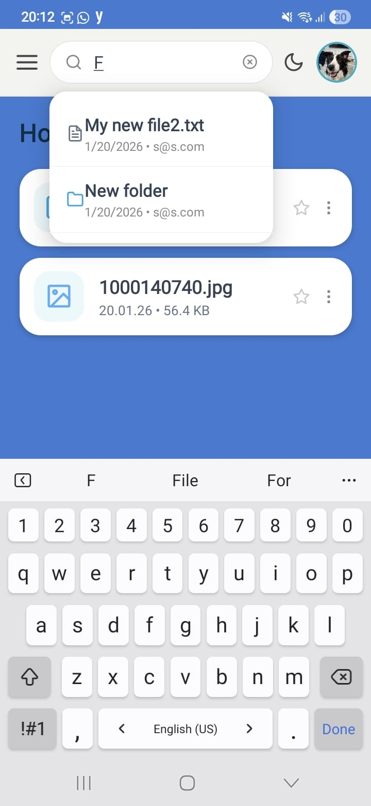
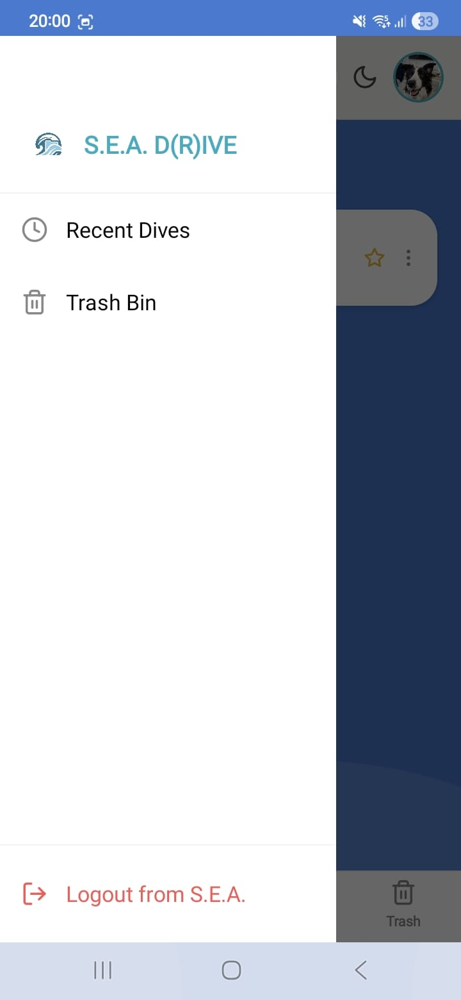

# File and Folder Management

The **S.E.A. D(R)IVE** dashboard provides a comprehensive interface for managing personal data, inspired by the Google Drive mobile experience.

## 1. Dashboard Navigation
The interface is optimized for mobile use, featuring a clean layout and intuitive navigation.

* **Dynamic File List**: The dashboard fetches and displays the user's specific files and folders from the server.
* **Folder Navigation (Stack Logic)**: Users can enter folders and sub-folders. The application maintains a "Folder Stack," allowing users to navigate deeper into their directories and return to previous levels using the back arrow.

## 2. File and Folder Operations
Users can interact with their data through various actions available in the Context Menu:

* **Creation**: Users can create new folders or upload documents and images directly from their mobile device.

* **Modification**: File and folder names can be updated (Rename), and files can be relocated within the directory structure (Move).

* **Status Toggles**: Users can "Star" important files for quick access or move unused items to the Trash.
* **Permanent Deletion**: Items in the trash can be permanently removed, ensuring they are deleted from the MongoDB database.

## 3. Collaborative Permissions
Files can be shared with other users through a robust permission system.

* **Role Assignments**: Users can be invited to a file with specific roles: VIEWER, EDITOR, or ADMIN.
* **Visual Management**: Access can be revoked or updated using intuitive visual cues, such as the red 'X' to remove a collaborator.
* **Error Handling**: If a user attempts to add a collaborator who already has access, the UI provides a clear error notification.

The search feature in **S.E.A. D(R)IVE** allows users to quickly locate files and folders across their entire drive, ensuring a smooth and efficient user experience.

## 1. Real-time Search Logic
To match the "Google Drive" feel, the search is designed to be intuitive:
* **Query Processing**: As the user types in the search bar, the application sends requests to the Node.js backend.
* **Database Filtering**: The server performs a regex-based search in the MongoDB database to find matches within the user's files and folders that they have permission to view.
* **Visual Results**: Matches are displayed in a dedicated results list, highlighting the names of the items found.

The UI provides clear feedback based on the search outcome:
* **Results Found**: If matches exist, they are displayed as a list. Clicking on a result will navigate the user directly to that file or folder's location.
* **Empty State**: If no matches are found, the system displays a "No results found" message, ensuring the user is aware that the search completed successfully but found no data.

* **Logging out**: If a user wants to log out of the app there are 2 ways : one by hitting the profile icon which pops up his information and a logout button :

another way is through the side bar that opens with a log out button as well 

