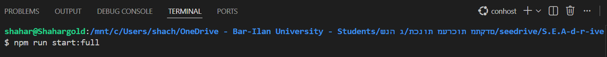
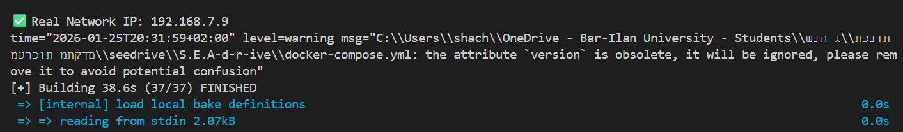
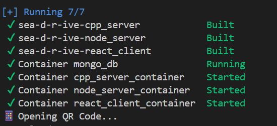
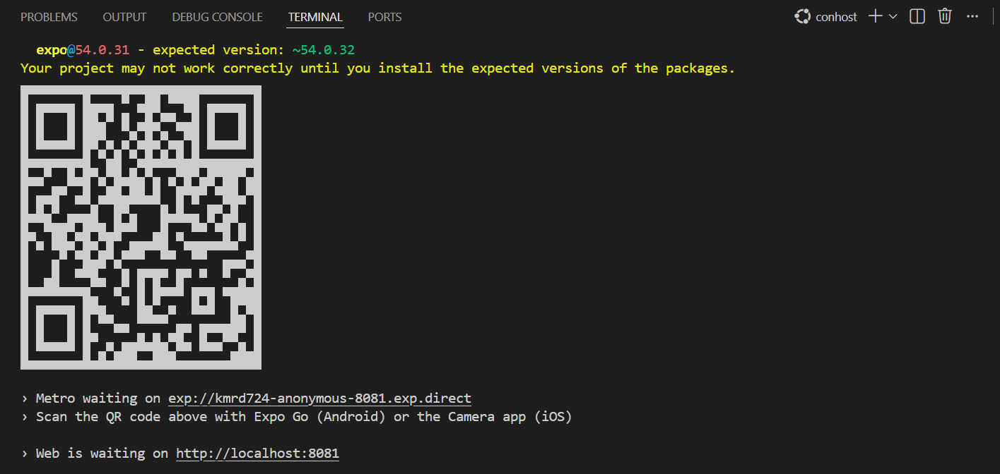
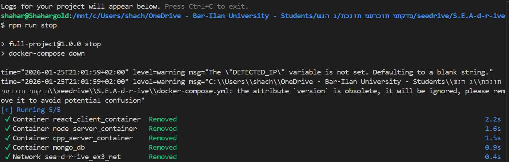

# System Setup & Execution Guide
This guide describes the process of compiling and running the full S.E.A. D(R)IVE system. The system consists of a Node.js server, a C++ server, a MongoDB database, and a React Native (Expo) client.

# 1. Prerequisites
Before starting, ensure Docker Desktop is open and running in the background.

# 2. Important: Firewall Configuration
To ensure the mobile client can communicate with the backend servers: Ensure your computer's firewall is not blocking incoming connections on ports 8080 (Node.js) and 8081 (Expo). If the app hangs on "Connecting", try temporarily allowing these ports in your security settings.

# 3. Running the System
We have simplified the deployment into a single command. Open your terminal in the project root and run:

npm run start:full

**What happens behind the scenes?**

IP Retrieval: The script identifies your IP

Environment Setup: This IP is passed to the containers so the React Native app knows where the server is located.

Docker Build: docker-compose builds and starts all 4 services in detached mode.

# 4. Verification
After the process completes, you should see that all 7 components (3 builds and 4 containers) are running successfully:

* mongo_db: Database service.
* cpp_server_container: C++ Logic server.
* node_server_container: Main API gateway.
* react_client_container: Expo development server.

# 5. Connecting via Expo Go
Once the containers are up, the terminal will automatically display a QR Code.
Open the Expo Go app on your phone -> Scan the QR code.

# 6. Stopping the System

To properly shut down the environment, follow these two steps:

* Press **`Ctrl + C`** in your terminal - This stops the `docker logs` process but leaves the containers running in the background.

* To fully stop and remove the service containers, run: **npm run stop**

**What this does:**

* Executes `docker-compose down` to stop all services (Node.js, C++, MongoDB, and Expo).
* Frees up system RAM and CPU resources.
* **Data Persistence**: Your files and database records are **not deleted**. They remain safely stored in the `mongo_data` and `./data_files` volumes for the next time you start the app.

