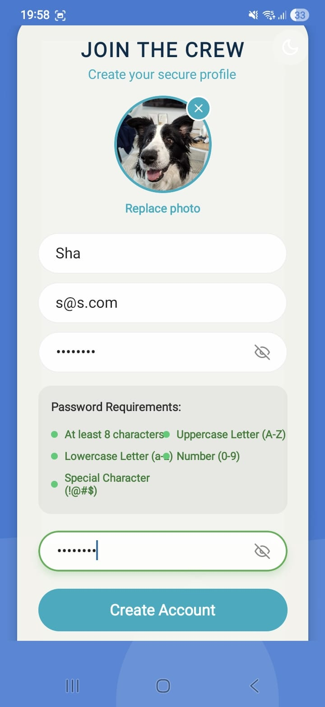
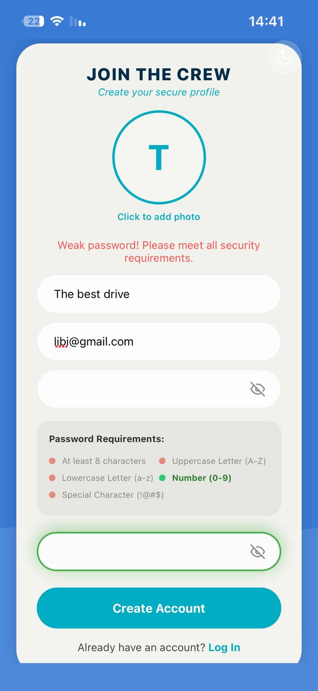
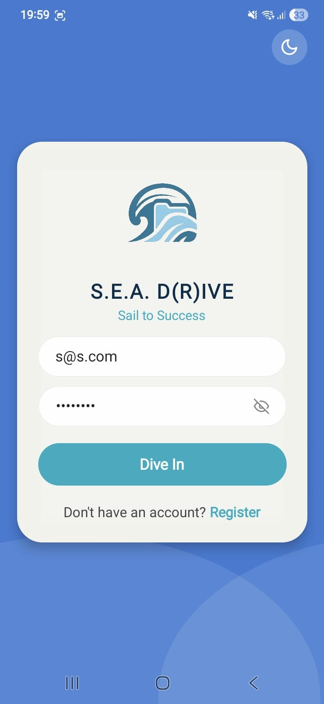
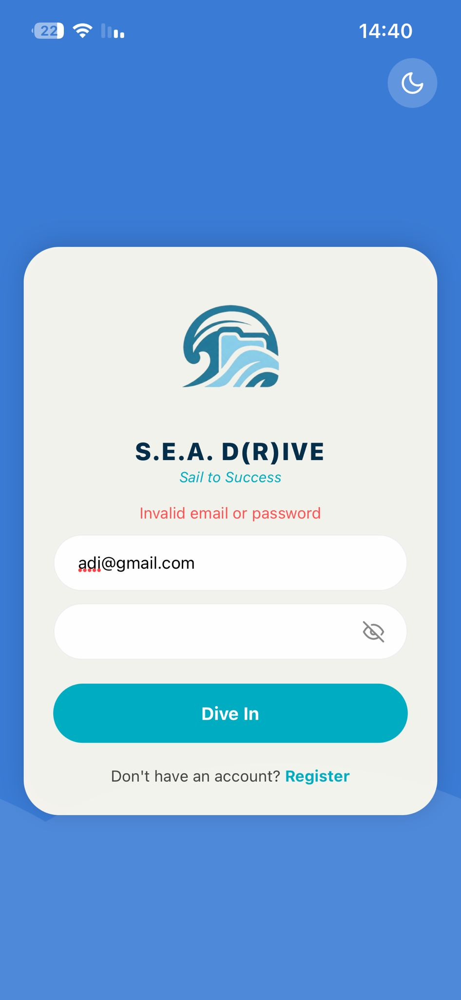
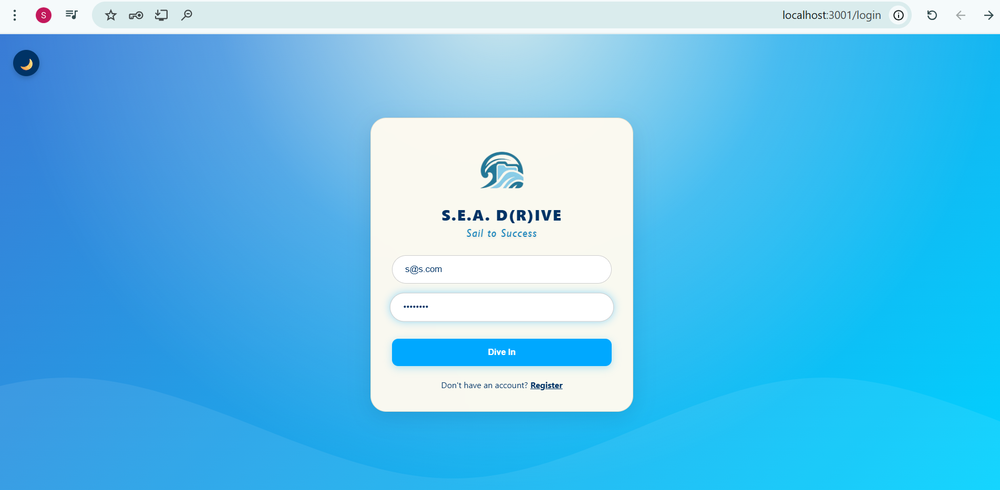

# User Authentication: Login and Registration

This document outlines the authentication processes for the **S.E.A. D(R)IVE** application, focusing on user security and data validation.

## 1. Registration Flow
The registration system is designed to onboard new users while ensuring all provided data is valid and secure.

* **Input Validation**: Every field in the registration form is mandatory. The system validates the email format and ensures the password meets security standards (minimum 8 characters with a mix of letters and numbers).
* **Real-time Feedback**: If a user enters invalid data or leaves a field empty, a clear red error message is displayed to guide them.
* **Profile Image Selection**: Users can select a profile picture from their device's gallery or camera. Once selected, the image is immediately displayed as a preview on the screen.
* **Account Verification**: The system checks the MongoDB database to ensure the email address is unique; if an account already exists, the user is notified.

## 2. Login Process
The login screen provides a secure entry point for existing users.

* **Authentication**: Users enter their credentials which are verified against the MongoDB database.
* **Error Handling**: In case of incorrect credentials, the app displays a specific "Invalid username or password" notification.
* **Persistence**: Successful login generates a session, allowing the user to access their private cloud storage.

### Cross-Platform Access
The authentication system is unified across all platforms. Users can also log in securely via the Web Interface using the same credentials, enjoying a synchronized experience between mobile and desktop.

